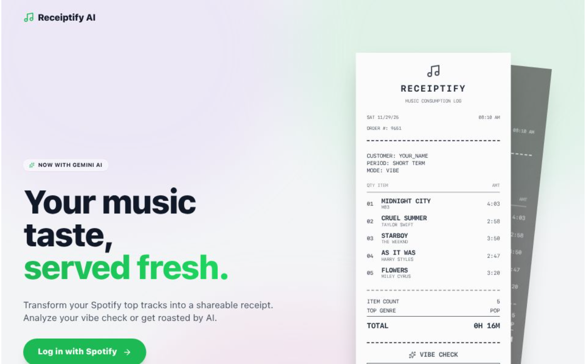

# 🧾 Receiptify



> **Your music stats, printed fresh.**  
> _A retro receipt generator and data analytics tool for Spotify._

## ✨ About The Project

**Statstify AI** (formerly Receiptify AI) is a dual-mode tool for Spotify users. It transforms your top tracks, artists, and genres into:

1.  **Receipts:** Aesthetic, thermal-paper track lists.
2.  **Analytics Reports:** Detailed data breakdowns of your audio profile, including artists rotation, mainstreamness, variety, time extremes, top genres, content, and decade categorization.

Built with **React 19**, **Tailwind CSS**, and **Google GenAI SDK**.

---

## 🚀 Features

- **Spotify Integration:** Securely fetches your Top Tracks (Last Month, 6 Months, All Time) via OAuth PKCE.
- **Deep Customization:**
  - **Themes:** Classic, Mint, Sakura, Dark Mode, Cyberpunk.
  - **Textures:** Clean, Crumpled Paper, Faded Thermal.
  - **Options:** Toggle album art, barcodes, and receipt length.
- **Export:** High-quality PNG download to share on socials.

---

## 🛠️ Tech Stack

- **Frontend:** [React](https://react.dev/) (v19)
- **Styling:** [Tailwind CSS](https://tailwindcss.com/)
- **AI Model:** [Google Gemini 2.5 Flash](https://ai.google.dev/) (`@google/genai`)
- **Auth:** Spotify Web API (PKCE Flow)
- **Icons:** [Lucide React](https://lucide.dev/)
- **Export:** `html-to-image`

---

## ⚙️ Getting Started

Follow these steps to set up the project locally.

### Prerequisites

- Node.js (v18+)
- A [Spotify Developer](https://developer.spotify.com/dashboard) account.
- A [Google AI Studio](https://aistudio.google.com/) account.

### 1. Clone the Repository

```bash
git clone https://github.com/yourusername/receiptify-ai.git
cd receiptify-ai
```

### 2. Install Dependencies

```bash
npm install
```

### 3. Configure Spotify API

1.  Go to the [Spotify Developer Dashboard](https://developer.spotify.com/dashboard).
2.  Create a new App.
3.  In the app settings, add your **Redirect URI**:
    - For local dev: `http://localhost:3000/callback`
    - _(Or your specific development URL if using Codespaces)_
4.  Create a `.env` file in the root directory (or set environment variables in your deployment platform):

```env
SPOTIFY_CLIENT_ID=0411015d069f408db5ab6f3d401253dd
SPOTIFY_REDIRECT_URI='http://localhost:3000/callback'; // Match what you put in dashboard
```

### 4. Configure Gemini API

1.  Get your API key from [Google AI Studio](https://aistudio.google.com/app/apikey).
2.  Open `.env` file and add:

```env
API_KEY=your_google_gemini_api_key_here
```

> **Note:** The application expects `process.env.API_KEY` to be available. If using Vite, you might need to prefix with `VITE_` or configure your bundler to expose this system variable.

### 5. Run the App

```bash
npm start
```

---

## 📸 How to Use

1.  **Log in:** Click "Log in with Spotify" on the landing page.
2.  **Customize:** Use the control panel to change the time range (Last Month, All Time), theme, and paper texture.
3.  **Vibe Check:** Switch the mode to **Vibe** or **Roast** to trigger the Gemini AI analysis.
4.  **Download:** Click "Save Image" to download your receipt.

---

## 🔒 Privacy

- **Token Security:** This app uses the **Authorization Code Flow with PKCE**, the recommended secure standard for client-side apps.
- **Data Handling:** Your Spotify data is processed entirely in your browser. It is sent to Google Gemini _only_ when you request an analysis, and only the track names/artists are sent as a text prompt. No user data is stored on any server.

---

## 📄 License

Distributed under the MIT License. See `LICENSE` for more information.

---

<div align="center">
  <p>Made with 🎵 and ☕️</p>
</div>
